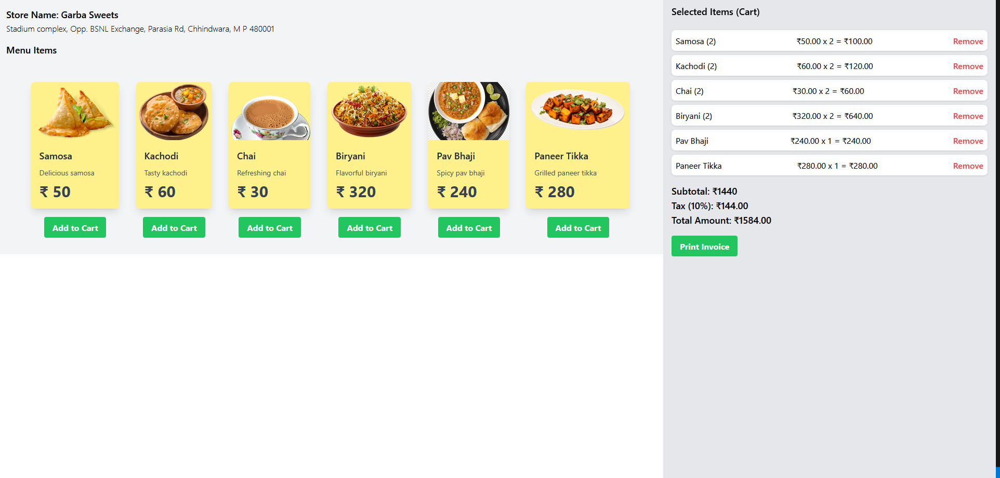

# 🍽️ Restaurant Billing System (React)

A modern, responsive web application for restaurant billing built using **React.js**. This intuitive system helps restaurants manage orders, add items to the cart, calculate taxes, and generate invoices in real-time.



---

## 🛍️ Features

- 🧾 Add menu items to the cart
- ✏️ Edit quantities and remove items
- 🧮 Auto-calculated Subtotal, Tax, and Total
- 📄 Invoice generation with one click
- 🖼️ Clean and responsive UI
- 🏪 Store details at the top
- ✅ GST/Tax calculation (customizable)

---

## 🚀 Tech Stack

- **Frontend:** React.js, CSS (Custom)
- **UI Libraries:** None (Fully custom design)
- **State Management:** React Hooks (`useState`)
- **Backend:** _Not Required_ (Pure frontend app)

---

## 🔧 Installation & Running Locally

1. **Clone the repository**
   ```bash
   git clone https://github.com/niteshpawar97/restaurant-billing.git
   cd restaurant-billing
